# 💧 Detection of Fraudulent Behaviour in Drinking Water Consumption

A machine learning-based Flask web application that detects potentially fraudulent water consumption behaviour using an **SVM (Support Vector Machine)** classification model.

## 📌 Project Overview

Water distribution agencies can face **Non-Technical Losses (NTL)** due to unauthorized or fraudulent consumption, meter manipulation, abnormal usage patterns, and other irregularities.

Traditional detection methods often depend on manual inspection, which can be time-consuming and costly.

This project uses machine learning to analyse customer water consumption and billing-related information and classify customers as:

- 🚨 **Fraud**
- ✅ **Non-Fraud**

The system provides a web-based interface where users can perform both **single-customer** and **bulk CSV-based predictions**.

---

## 🎯 Objectives

- Detect suspicious water consumption behaviour using machine learning.
- Reduce dependency on manual inspection.
- Identify customers who may require further investigation.
- Provide fraud probability along with prediction results.
- Provide a simple and professional web interface for predictions.

---

## 🧠 Machine Learning Model

The project uses **Support Vector Machine (SVM)** for classification.

### Algorithm

**SVM (Support Vector Machine)**

The SVM model is trained to distinguish between fraudulent and non-fraudulent consumption patterns.

### Data Preprocessing

- Feature engineering
- Train-test splitting
- Feature scaling using `StandardScaler`
- Class balancing using `class_weight='balanced'`

### Engineered Features

The following additional features are calculated:

- `Usage_Ratio`
- `Billing_Per_Usage`
- `Deviation_Ratio`

---

## 📊 Dataset Features

The model uses customer consumption, billing, payment, and account-related information.

| Feature | Description |
|---|---|
| Avg_Monthly_Usage_KL | Average monthly water consumption |
| Current_Month_Usage_KL | Current month's consumption |
| Billing_Amount | Customer billing amount |
| Payment_Delay_Days | Number of delayed payment days |
| Usage_Deviation | Difference from normal usage |
| Account_Age_Months | Age of the customer account |
| Payment_History_Score | Payment behaviour score |
| Neighborhood_Avg_Usage | Average usage in the customer's neighbourhood |
| Seasonal_Factor | Seasonal variation factor |
| Previous_Fraud_Flags | Previous fraud-related flags |
| Usage_Ratio | Current usage compared with average usage |
| Billing_Per_Usage | Billing amount relative to usage |
| Deviation_Ratio | Usage deviation relative to average usage |

---

## 🏗️ System Architecture

```text
Customer Water Consumption Data
              ↓
       Data Preprocessing
              ↓
        Feature Engineering
              ↓
       StandardScaler
              ↓
       SVM Classification
              ↓
       Fraud Probability
              ↓
       Prediction Result
              ↓
        Flask Web Interface


## 🌐 Web Application Features

### 🔐 User Authentication

- User registration
- Secure password hashing
- Login and logout functionality

### 👤 Single Customer Prediction

Users can enter individual customer information and receive:

- Fraud / Non-Fraud classification
- Fraud probability

### 📁 Bulk Prediction

Users can upload a CSV file containing multiple customer records.

The system analyses the records and displays:

- Customer prediction
- Fraud probability
- Fraudulent customers
- Non-fraudulent customers

### 📊 Dashboard

The dashboard provides an overview of the prediction system and the machine learning approach.

## 🛠️ Technologies Used

### Programming Language
- Python

### Machine Learning
- Scikit-learn
- Support Vector Machine (SVM)
- StandardScaler

### Web Development
- Flask
- HTML
- CSS
- Jinja2

### Database
- MySQL

### Data Processing
- Pandas
- NumPy

### Model Storage
- Joblib
- Pickle

### Development Tools
- Visual Studio Code
- MySQL Workbench
- Git
- GitHub

## 📁 Project Structure

```text
water_fraud_detection/
│
├── app.py
├── train_model.py
├── check_pkl.py
├── backend_analysis.py
├── requirements.txt
├── README.md
├── .gitignore
│
├── model_files/
│   ├── best_fraud_detection_model_SVM.pkl
│   ├── scaler.pkl
│   └── feature_names.pkl
│
├── templates/
│   ├── login.html
│   ├── signup.html
│   ├── dashboard.html
│   ├── predict.html
│   └── upload.html
│
├── static/
│   └── images/
│
├── screenshots/
│
├── final_water_consumption_fraud_dataset.csv
└── test_dataset_50.csv
```

## ⚙️ Installation & Setup

### 1. Clone the repository

```bash
git clone https://github.com/YOUR_USERNAME/water-fraud-detection.git
```
1. OPEN THE PROJECT
```bash
cd water-fraud-detection
```

2.CREATE A VIRTUAL ENVIRONMENT
```bash
python -m venv venv
```
3.ACTIVATE THE VIRTUAL ENVIRONMENT
```bash
venv\Scripts\activate
```
4.INSTALL DEPENDENCIES
```bash
pip install -r requirements.txt
```

### 5. CONFIGURE ENVIRONMENT VARIABLES

Create a `.env` file in the project folder:

```text
DB_HOST=127.0.0.1
DB_USER=root
DB_PASSWORD=YOUR_MYSQL_PASSWORD
DB_NAME=fraud_water
```
6.START THE FLASK APPLICATION
```bash
python app.py
```

## 📸 Screenshots

### 🔐 Login & Registration

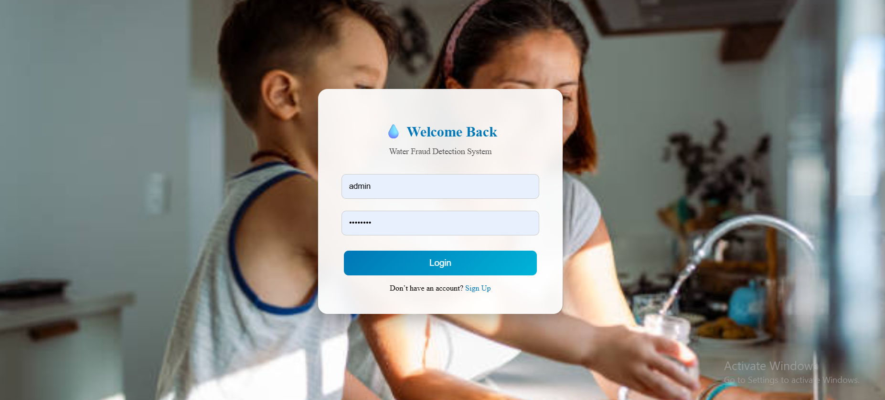
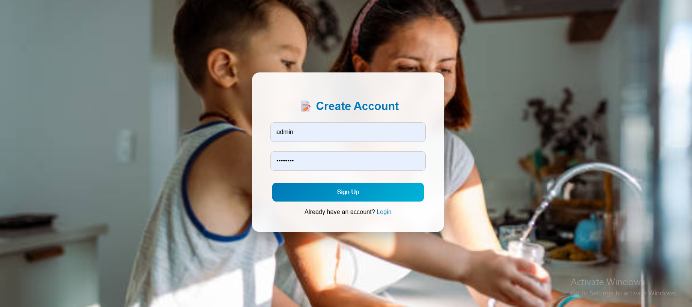

### 📊 Dashboard

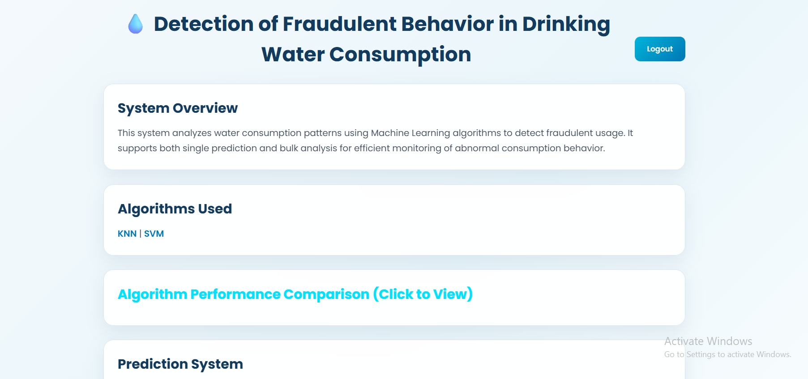
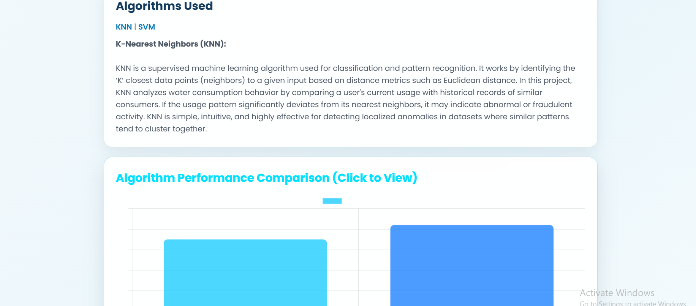

### 🔮 Prediction Options

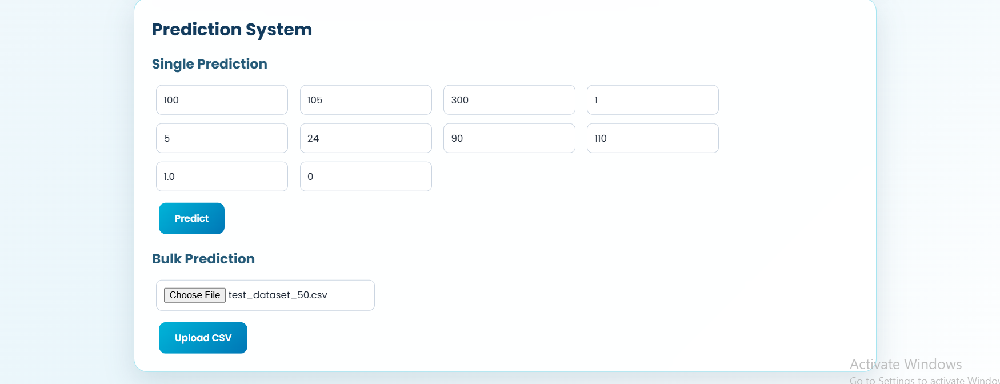

### 👤 Single Customer Prediction

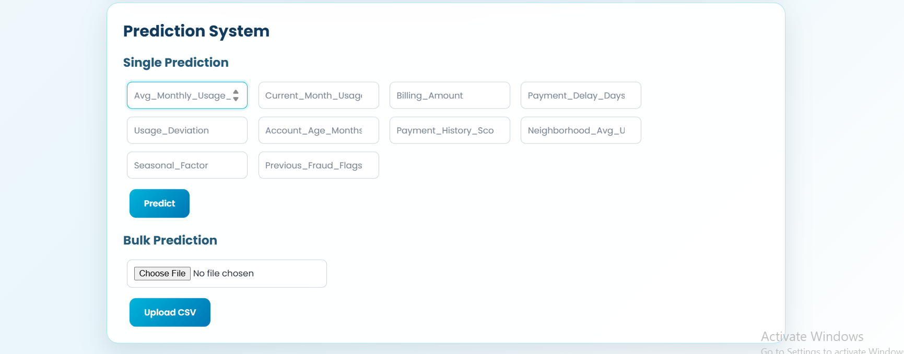
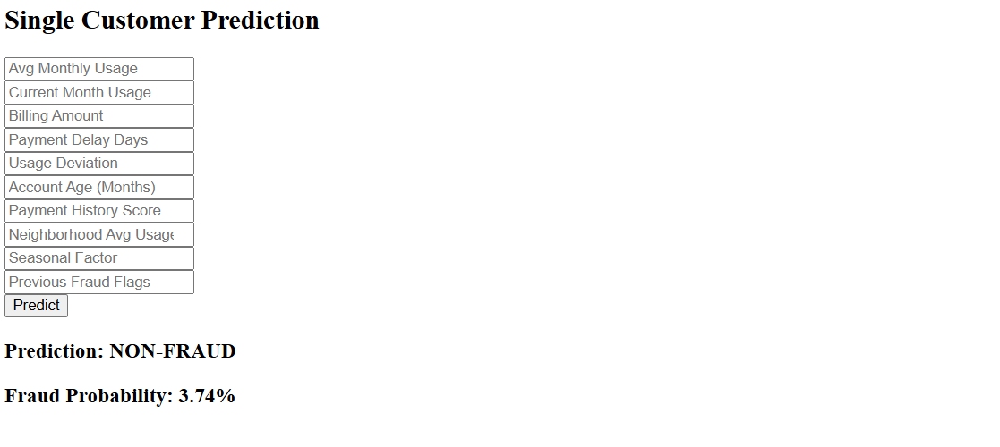
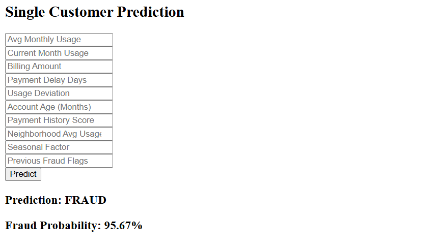

### 📁 Bulk Prediction

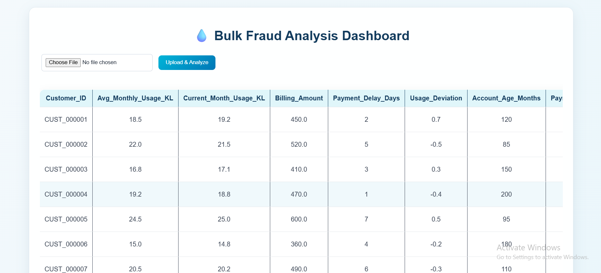
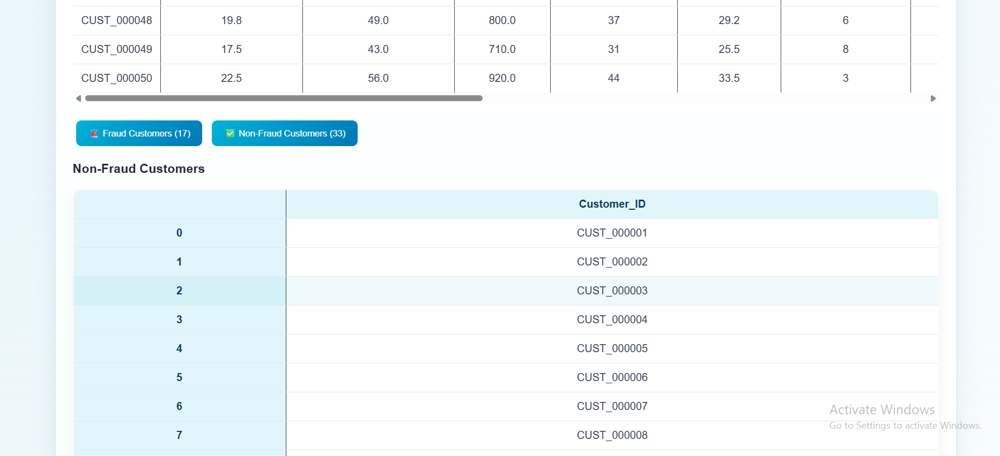
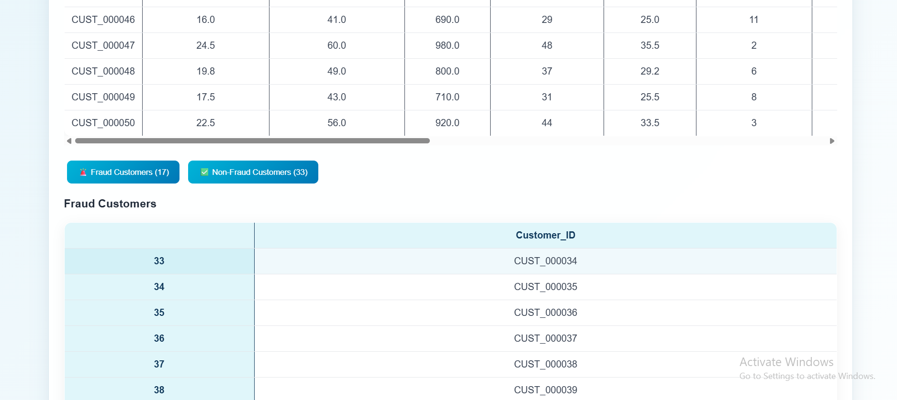

